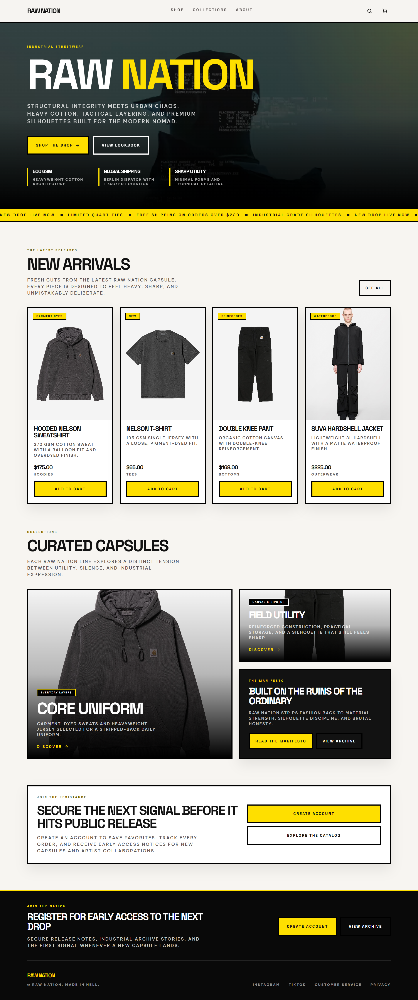
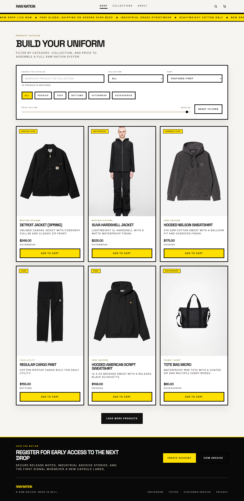
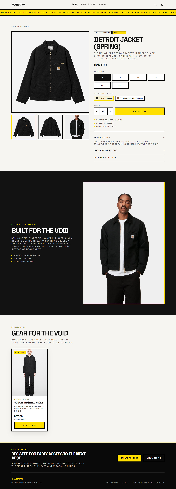
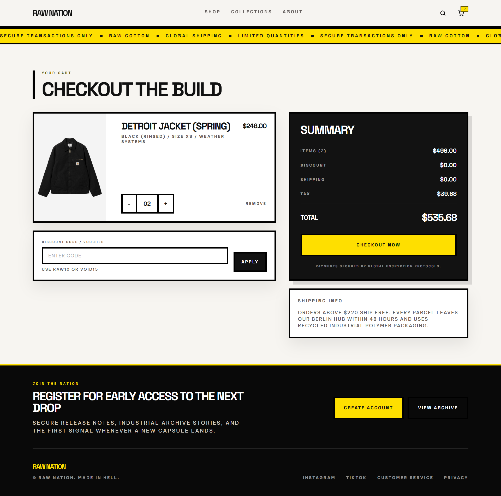

# RAW NATION

Premium fashion e-commerce storefront built with React, Vite, Tailwind CSS, and React Router.

## Live Demo

URL:

`[https://your-vercel-project.vercel.app](https://raw-nation.vercel.app/)`


## Screenshots






## Overview

RAW NATION is a modern apparel storefront focused on a premium editorial look, responsive shopping flows, and a fully functional cart experience. The project includes custom product pages, collection storytelling, authentication screens, and a catalog powered by structured product data.

## Features

- Responsive multi-page storefront with React Router
- Product catalog with filtering, sorting, and search
- Dynamic product detail pages
- Fully functional shopping cart with quantity updates and totals
- Cart persistence with `localStorage`
- Collection, About, Login, and Signup pages
- Reusable component-driven UI architecture
- Tailwind CSS styling with custom brand presentation
- Linting and production build support with Vite

## Tech Stack

- React 19
- Vite
- Tailwind CSS 4
- React Router DOM 7
- Context API for cart state
- ESLint


## Getting Started

### 1. Install dependencies

```bash
npm install
```

### 2. Start the development server

```bash
npm run dev
```

### 3. Build for production

```bash
npm run build
```

### 4. Preview the production build

```bash
npm run preview
```

### 5. Run linting

```bash
npm run lint
```

## Cart Behavior

- Cart state is managed through the Context API
- Cart data is persisted in `localStorage`
- Totals include subtotal, shipping, tax, and final total

## Product Data

Product and collection content lives in:

- `src/data/products.js`

This file powers:

- featured products
- new arrivals
- category filters
- collection sections
- product detail pages

